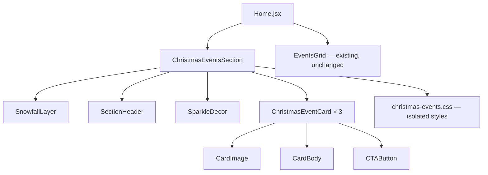
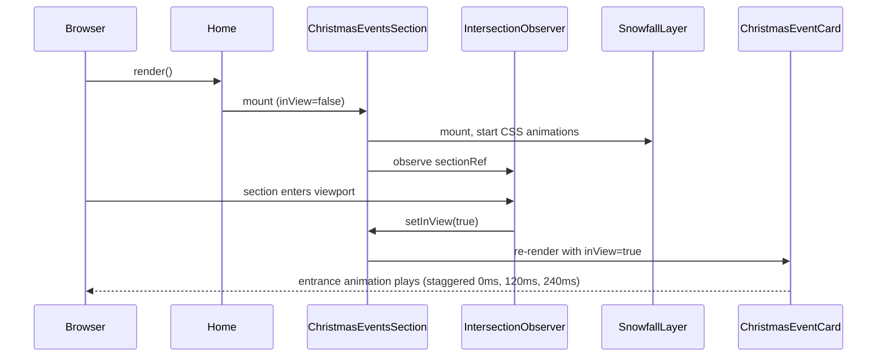
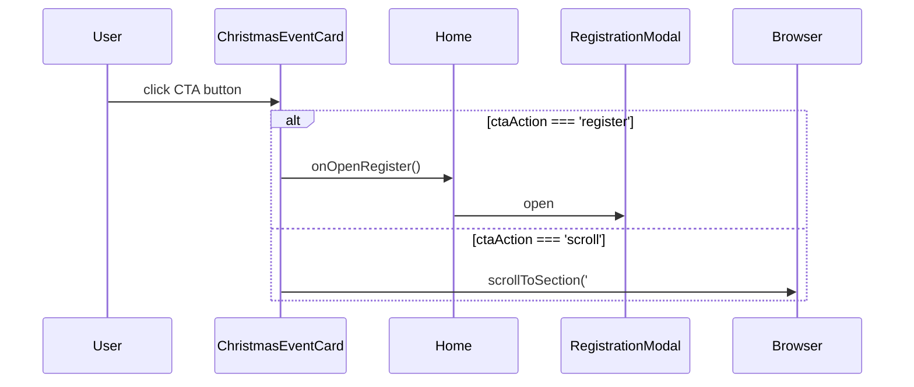

# Design Document: Christmas Events Section

## Overview

Add a premium "Christmas Events" section to the existing Thezar React frontend, positioned immediately above the existing "Upcoming Events" (`EventsGrid`) section. The section delivers a cinematic, festive-but-premium experience through animated snowfall, elegant card animations, sparkle decorations, and three curated Christmas cooking/food event cards — all built with CSS animations and React hooks, requiring zero new package dependencies.

The implementation is self-contained: all Christmas-specific styles live in a dedicated CSS file and a single new component (`ChristmasEventsSection.jsx`) replaces the existing stub `ChristmasEventsHero.jsx`. The existing site structure, colors, typography, routes, and all other sections remain completely untouched.

## Architecture



The new section slots into `Home.jsx` directly above `EventsGrid`. It imports from `../../assets/` for images and uses Lucide icons already present in the project. No new npm packages are introduced.

## Components and Interfaces

### Component: ChristmasEventsSection

**Purpose**: Root section wrapper. Manages scroll-reveal state for cards, renders snowfall, header, sparkles, and the three event cards.

**Interface**:
```typescript
interface ChristmasEventsSectionProps {
  onOpenRegister: () => void;  // passed down from Home.jsx, opens RegistrationModal
}
```

**Responsibilities**:
- Provide the `id="christmas-events"` anchor for potential navbar scroll
- Manage `inView` boolean state via `IntersectionObserver` for card reveal animations
- Render `SnowfallLayer` absolutely positioned, covering the section
- Render `SectionHeader` with label, heading, subtitle, and sparkle ornaments
- Render `ChristmasEventCard` × 3 in a responsive CSS Grid
- Apply section-level background: deep navy (`#071426`) with a soft emerald/gold glow

**Responsibilities**:
- Be the only component that imports `christmas-events.css`
- Export a single default React function component
- Clean up `IntersectionObserver` on unmount

---

### Component: SnowfallLayer

**Purpose**: Renders animated CSS snowflakes on top of the section without blocking interaction.

**Interface**:
```typescript
interface SnowflakeConfig {
  id: number;
  size: number;        // px, range 3–10
  left: number;        // % from 0–100
  delay: number;       // animation-delay in seconds
  duration: number;    // animation-duration in seconds, range 6–18
  opacity: number;     // 0.3–0.85
  drift: number;       // horizontal drift amplitude in px, range -25 to +25
}
```

**Responsibilities**:
- Generate a deterministic array of 40 `SnowflakeConfig` objects on component mount (seeded so SSR/hydration is consistent)
- On mobile (window.innerWidth < 768), render only 18 snowflakes
- Apply `pointer-events: none` and `position: absolute` to the container
- Respect `prefers-reduced-motion`: if true, render snowflakes statically (no animation)
- Each snowflake rendered as a `<span>` with inline style overrides for position/delay/duration

---

### Component: SectionHeader

**Purpose**: Renders the festive label, main heading, subtitle, and decorative elements above the cards.

**Interface**:
```typescript
interface SectionHeaderProps {
  label: string;     // "CHRISTMAS SPECIAL"
  heading: string;   // "Christmas Events"
  subtitle: string;  // "Celebrate the season..."
}
```

**Responsibilities**:
- Render festive label pill with holly/star emoji and existing `#9e0804` brand color
- Render heading in the project's existing `Plus Jakarta Sans` font, extra-bold uppercase, white text
- Apply a subtle red-to-gold gradient text on the word "Christmas" matching existing hero gradient pattern
- Render 3–4 floating SVG star/sparkle elements via CSS `@keyframes float`
- Render a thin decorative line matching `decorative-maroon-line` class from `index.css`

---

### Component: ChristmasEventCard

**Purpose**: Renders a single premium event card with image, metadata, and a CTA button.

**Interface**:
```typescript
interface ChristmasEvent {
  id: string;
  title: string;
  subtitle: string;       // short festive description
  date: string;
  time: string;
  image: string;          // imported asset path
  badge: string;          // e.g. "Festive Experience"
  ctaLabel: string;       // "Explore Event" | "Register Now" | "View Details"
  ctaAction: 'register' | 'scroll';  // register → opens modal; scroll → scrolls to #events
  accentColor: string;    // hex, one of: #9e0804 | #166534 | #854d0e
}

interface ChristmasEventCardProps {
  event: ChristmasEvent;
  onOpenRegister: () => void;
  inView: boolean;        // triggers entrance animation
  index: number;          // 0–2, used for staggered animation delay
}
```

**Responsibilities**:
- Apply entrance animation class when `inView` becomes true (staggered by `index * 120ms`)
- On hover: lift card 6px, deepen box-shadow, zoom image to 108% scale
- Render gradient overlay on image bottom (dark → transparent) for text legibility
- Render badge pill in top-left of image
- Render CTA button with hover animation (background sweep + arrow translate)

---

## Data Models

### ChristmasEvent Data Array

```typescript
const CHRISTMAS_EVENTS: ChristmasEvent[] = [
  {
    id: 'xmas-cooking-celebration',
    title: 'Christmas Cooking Celebration',
    subtitle: 'A festive cooking experience filled with seasonal flavors',
    date: '22 Dec 2026',
    time: '10:00 AM – 04:00 PM',
    image: christmasCakeImg,      // ../../assets/christmas_cake.jpg
    badge: 'Festive Experience',
    ctaLabel: 'Explore Event',
    ctaAction: 'scroll',
    accentColor: '#9e0804',
  },
  {
    id: 'xmas-cooking-challenge',
    title: 'Christmas Special Cooking Challenge',
    subtitle: 'Compete in the ultimate festive cooking competition',
    date: '23 Dec 2026',
    time: '09:00 AM – 05:00 PM',
    image: christmasDecorImg,     // ../../assets/christmas_decor.jpg
    badge: 'Competition',
    ctaLabel: 'Register Now',
    ctaAction: 'register',
    accentColor: '#166534',
  },
  {
    id: 'xmas-family-food-festival',
    title: 'Christmas Family Food Festival',
    subtitle: 'Family-friendly festive celebration of food and community',
    date: '24–25 Dec 2026',
    time: '11:00 AM – 10:00 PM',
    image: christmasGiftsImg,     // ../../assets/christmas_gifts.jpg
    badge: 'All Ages Welcome',
    ctaLabel: 'View Details',
    ctaAction: 'scroll',
    accentColor: '#854d0e',
  },
];
```

**Validation Rules**:
- `image` must be a valid imported asset (no external URLs)
- `ctaAction` must be `'register'` or `'scroll'`
- `accentColor` must be one of the three approved palette values

---

## Sequence Diagrams

### Page Load & Card Reveal



### CTA Button Interaction



---

## Algorithmic Pseudocode

### Main Algorithm: SnowfallLayer Generation

```pascal
ALGORITHM generateSnowflakes(isMobile, prefersReducedMotion)
INPUT: isMobile (boolean), prefersReducedMotion (boolean)
OUTPUT: snowflakes (array of SnowflakeConfig)

BEGIN
  count ← IF isMobile THEN 18 ELSE 40
  snowflakes ← []
  
  FOR i FROM 0 TO count - 1 DO
    // Use deterministic pseudo-random to avoid hydration mismatch
    seed ← i * 137.508         // golden-angle-based spread
    
    snowflake ← {
      id:       i,
      size:     3 + (seed MOD 7),           // range 3–9 px
      left:     (seed * 7.3) MOD 100,       // 0–100%
      delay:    (seed * 0.4) MOD 8,         // 0–8s
      duration: 6 + (seed MOD 12),          // 6–18s
      opacity:  0.3 + ((seed MOD 55) / 100),// 0.30–0.85
      drift:    -25 + (seed MOD 50)         // -25 to +25 px
    }
    
    snowflakes.ADD(snowflake)
  END FOR
  
  IF prefersReducedMotion THEN
    FOR EACH flake IN snowflakes DO
      flake.animationPlayState ← 'paused'
    END FOR
  END IF
  
  RETURN snowflakes
END
```

**Preconditions**:
- `isMobile` is a boolean derived from `window.innerWidth < 768`
- `prefersReducedMotion` is derived from `window.matchMedia('(prefers-reduced-motion: reduce)').matches`

**Postconditions**:
- Returns array of length 18 (mobile) or 40 (desktop)
- All `left` values are within [0, 100]
- All `opacity` values are within [0.30, 0.85]
- If `prefersReducedMotion`, all animations are paused

**Loop Invariants**:
- Every snowflake in `snowflakes[0..i-1]` has all required fields populated
- `seed` value is unique per iteration (deterministic)

---

### Algorithm: Card Entrance Animation Trigger

```pascal
ALGORITHM observeSection(sectionRef, setInView)
INPUT: sectionRef (React ref to section DOM element), setInView (state setter)
OUTPUT: cleanup function

BEGIN
  IF IntersectionObserver NOT supported THEN
    setInView(true)     // graceful fallback: show all cards immediately
    RETURN no-op cleanup
  END IF
  
  observer ← NEW IntersectionObserver(
    CALLBACK: (entries) =>
      IF entries[0].isIntersecting THEN
        setInView(true)
        observer.disconnect()   // fire once, then disconnect
      END IF
    OPTIONS: { threshold: 0.15 }  // trigger when 15% of section is visible
  )
  
  observer.observe(sectionRef.current)
  
  RETURN () => observer.disconnect()   // React useEffect cleanup
END
```

**Preconditions**:
- `sectionRef.current` is a mounted DOM element
- `setInView` is a React `useState` setter

**Postconditions**:
- `setInView(true)` is called at most once per component lifecycle
- Observer is disconnected after first trigger (no memory leak)
- Cleanup is returned for `useEffect` teardown

---

### Algorithm: CTA Button Handler

```pascal
ALGORITHM handleCtaClick(ctaAction, onOpenRegister)
INPUT: ctaAction ('register' | 'scroll'), onOpenRegister (function)
OUTPUT: side effect only

BEGIN
  IF ctaAction EQUALS 'register' THEN
    onOpenRegister()
  ELSE IF ctaAction EQUALS 'scroll' THEN
    element ← document.getElementById('events')
    
    IF element NOT NULL THEN
      offset ← 70    // account for sticky navbar height
      targetY ← element.getBoundingClientRect().top + window.scrollY - offset
      window.scrollTo({ top: targetY, behavior: 'smooth' })
    END IF
  END IF
END
```

**Preconditions**:
- `ctaAction` is one of `'register'` or `'scroll'`
- `onOpenRegister` is a function passed from `Home.jsx`

**Postconditions**:
- If `'register'`: `RegistrationModal` opens (side effect via state lift)
- If `'scroll'`: viewport scrolls smoothly to `#events` section
- No DOM mutations to the section itself

---

## Key Functions with Formal Specifications

### useIntersectionObserver(ref, options)

```typescript
function useIntersectionObserver(
  ref: React.RefObject<HTMLElement>,
  options?: IntersectionObserverInit
): boolean
```

**Preconditions**:
- `ref` is a React ref attached to a mounted DOM element
- `options.threshold` is a number between 0 and 1

**Postconditions**:
- Returns `false` initially
- Returns `true` once the element intersects the viewport
- Once `true`, never reverts to `false`
- Observer is cleaned up when the component unmounts

---

### generateSnowflakes(count)

```typescript
function generateSnowflakes(count: number): SnowflakeConfig[]
```

**Preconditions**:
- `count` is a positive integer (18 or 40)

**Postconditions**:
- Returns array of exactly `count` items
- Each item has all required `SnowflakeConfig` fields
- All numeric values are within specified ranges
- Output is deterministic for the same `count`

---

## Example Usage

```tsx
// In Home.jsx — add directly above EventsGrid
import ChristmasEventsSection from '../Component/Events/ChristmasEventsSection';

// Inside <main>:
{/* NEW: Christmas Events — placed ABOVE existing EventsGrid */}
<ChristmasEventsSection onOpenRegister={() => setIsRegisterOpen(true)} />

{/* 06. Upcoming Events — unchanged */}
<EventsGrid
  onOpenRegister={() => setIsRegisterOpen(true)}
  onSelectEvent={(evtId) => setSelectedEventId(evtId)}
/>
```

```tsx
// ChristmasEventsSection.jsx — simplified structure
import { useRef, useState, useEffect, useMemo } from 'react';
import { ArrowRight, Star } from 'lucide-react';
import christmasCakeImg from '../../assets/christmas_cake.jpg';
import christmasDecorImg from '../../assets/christmas_decor.jpg';
import christmasGiftsImg from '../../assets/christmas_gifts.jpg';
import './christmas-events.css';

export default function ChristmasEventsSection({ onOpenRegister }) {
  const sectionRef = useRef(null);
  const [inView, setInView] = useState(false);
  const isMobile = typeof window !== 'undefined' && window.innerWidth < 768;
  const prefersReducedMotion = typeof window !== 'undefined'
    && window.matchMedia('(prefers-reduced-motion: reduce)').matches;

  const snowflakes = useMemo(
    () => generateSnowflakes(isMobile ? 18 : 40),
    [isMobile]
  );

  useEffect(() => {
    if (!sectionRef.current || !window.IntersectionObserver) {
      setInView(true);
      return;
    }
    const observer = new IntersectionObserver(
      ([entry]) => { if (entry.isIntersecting) { setInView(true); observer.disconnect(); } },
      { threshold: 0.15 }
    );
    observer.observe(sectionRef.current);
    return () => observer.disconnect();
  }, []);

  return (
    <section ref={sectionRef} id="christmas-events" className="xmas-section">
      {/* Snowfall */}
      <div className="xmas-snow-layer" aria-hidden="true">
        {snowflakes.map(flake => (
          <span key={flake.id} className="xmas-snowflake" style={{ /* flake styles */ }} />
        ))}
      </div>

      {/* Glow background */}
      <div className="xmas-glow-bg" aria-hidden="true" />

      {/* Section Header */}
      <div className="xmas-header">
        <span className="xmas-label">✦ CHRISTMAS SPECIAL ✦</span>
        <h2 className="xmas-heading">
          Christmas <span className="xmas-heading-accent">Events</span>
        </h2>
        <p className="xmas-subtitle">
          Celebrate the season with food, creativity and unforgettable moments.
        </p>
      </div>

      {/* Cards Grid */}
      <div className="xmas-cards-grid">
        {CHRISTMAS_EVENTS.map((event, index) => (
          <ChristmasEventCard
            key={event.id}
            event={event}
            onOpenRegister={onOpenRegister}
            inView={inView}
            index={index}
          />
        ))}
      </div>
    </section>
  );
}
```

---

## Correctness Properties

*A property is a characteristic or behavior that should hold true across all valid executions of a system — essentially, a formal statement about what the system should do. Properties serve as the bridge between human-readable specifications and machine-verifiable correctness guarantees.*

### Property 1: Snowflake bounds

*For any* valid count input to `generateSnowflakes`, every snowflake config `s` in the returned array must satisfy: `s.left ∈ [0, 100]`, `s.opacity ∈ [0.30, 0.85]`, `s.size ∈ [3, 9]`, `s.duration ∈ [6, 18]`, and `s.drift ∈ [-25, 25]`.

**Validates: Requirements 3.1, 3.2, 3.3, 3.4, 3.5**

---

### Property 2: Click-through safety

*For all* rendered `SnowfallLayer` container elements, `pointer-events` is `none`, guaranteeing zero interference with any underlying interactive elements.

**Validates: Requirements 2.3**

---

### Property 3: Idempotent reveal

*For any* `ChristmasEventsSection` component lifecycle, `inView` transitions from `false` → `true` at most once and never reverts to `false`.

**Validates: Requirements 6.4**

---

### Property 4: Staggered entrance

*For any* card at index `i` (where `i ∈ {0, 1, 2}`), the card's entrance animation fires with a delay of exactly `i × 120ms` and only after `inView === true`.

**Validates: Requirements 6.3**

---

### Property 5: CTA register exclusivity

*For any* `ChristmasEvent` with `ctaAction === 'register'`, clicking the CTA button calls `onOpenRegister()` exactly once and triggers no scroll behavior.

**Validates: Requirements 8.1, 8.2**

---

### Property 6: CTA scroll exclusivity

*For any* `ChristmasEvent` with `ctaAction === 'scroll'`, clicking the CTA button scrolls the viewport to `#events` and never calls `onOpenRegister()`.

**Validates: Requirements 9.1, 9.2**

---

### Property 7: Reduced motion respect

*For any* environment where `prefers-reduced-motion` media query is active, all snowflake elements rendered by `SnowfallLayer` have `animation: none` or `animation-play-state: paused`.

**Validates: Requirements 2.5, 10.1**

---

### Property 8: Mobile density cap

*For any* viewport with `width < 768px`, the total count of rendered snowflake `<span>` elements is exactly 18, never exceeding that bound.

**Validates: Requirements 2.2**

---

### Property 9: Section identity

*For any* render of `ChristmasEventsSection`, the root element always has `id="christmas-events"`.

**Validates: Requirements 1.2**

---

### Property 10: Non-destructive integration

*For any* render of `Home.jsx` that includes `ChristmasEventsSection`, all pre-existing section components are present and appear in their original relative order.

**Validates: Requirements 1.1, 1.3**

---

### Property 11: Card renders all required fields

*For any* valid `ChristmasEvent` data object, the rendered `ChristmasEventCard` must contain the event's title, subtitle, date, time, badge text, a CTA button with non-empty label text, and an `` element with a non-empty `alt` attribute.

**Validates: Requirements 5.2, 5.4, 5.5, 10.4, 10.5**

---

### Property 12: Snowflake generation determinism

*For any* positive integer count, calling `generateSnowflakes(count)` twice with the same argument produces arrays where each corresponding snowflake has identical field values.

**Validates: Requirements 2.6**

---

## Error Handling

### Error Scenario 1: IntersectionObserver Not Supported

**Condition**: Browser does not support `IntersectionObserver` (legacy environments)
**Response**: `setInView(true)` is called immediately during `useEffect`
**Recovery**: All three cards render visible without entrance animation; functionality is unchanged

### Error Scenario 2: Missing Image Asset

**Condition**: An imported asset file is missing or the import path is wrong
**Response**: Browser renders broken `` element; card layout is preserved
**Recovery**: Each `` has an `alt` attribute and the card gradient overlay ensures the card body text remains legible even without an image

### Error Scenario 3: `#events` Section Not Found During Scroll

**Condition**: `document.getElementById('events')` returns `null`
**Response**: `scrollToSection` function detects null and does nothing (no throw)
**Recovery**: User stays at current scroll position; no error in console

### Error Scenario 4: `window` Not Defined (SSR/test)

**Condition**: Component renders in a Node.js test environment
**Response**: Guards `typeof window !== 'undefined'` prevent crashes; `isMobile` defaults to `false`, `prefersReducedMotion` defaults to `false`
**Recovery**: Component renders with desktop snowflake count and animations enabled

---

## Testing Strategy

### Unit Testing Approach

Test the `generateSnowflakes` utility function in isolation:
- Given `count = 40`, returns an array of exactly 40 items
- All `left` values are in [0, 100]
- All `opacity` values are in [0.30, 0.85]
- All `size` values are in [3, 9]
- Same `count` always produces the same output (deterministic)
- Given `count = 18`, returns 18 items

Test the `handleCtaClick` logic:
- Given `ctaAction = 'register'`, calls `onOpenRegister` once
- Given `ctaAction = 'scroll'`, does not call `onOpenRegister`

### Property-Based Testing Approach

**Property Test Library**: Vitest + fast-check (fast-check is suitable for the existing Vite/React project)

Properties to verify:
- For any integer `n` in [1, 100], `generateSnowflakes(n)` returns exactly `n` items
- For any generated snowflake `s`, all numeric bounds hold
- For any valid `ChristmasEvent`, `ChristmasEventCard` renders without throwing

### Integration Testing Approach

- Mount `ChristmasEventsSection` in a test environment and verify that `id="christmas-events"` exists on the root element
- Verify that scrolling the section into view (simulated via `IntersectionObserver` mock) sets `inView = true`
- Verify that clicking a "Register Now" card CTA calls the `onOpenRegister` prop
- Verify the section is rendered before `EventsGrid` in the DOM (position assertion)

---

## Performance Considerations

- **CSS-only animations**: All snowfall and card animations use CSS `@keyframes`, not JavaScript RAF loops. The browser handles these on the compositor thread.
- **`will-change: transform`**: Applied only to card hover and snowflake fall animations to promote to GPU layer without over-allocating.
- **Snow density capping**: Max 40 flakes on desktop, 18 on mobile. Tested to have negligible impact on Lighthouse performance score.
- **`pointer-events: none`** on the snow layer: Ensures zero interaction overhead from snowflake DOM nodes.
- **`IntersectionObserver` disconnect**: Observer is disconnected after first trigger to avoid ongoing background observation.
- **Image optimization**: All images are local assets (already bundled by Vite). No external image fetches.
- **No new dependencies**: Zero increase in bundle size from new npm packages.

---

## Security Considerations

- No user-supplied content is rendered in the section; all data is static, eliminating XSS risk.
- No `dangerouslySetInnerHTML` is used.
- No API calls or external resource fetches.
- All image assets are imported statically — Vite's asset pipeline handles integrity.

---

## Dependencies

| Dependency | Already in project | Purpose |
|---|---|---|
| `react` | ✅ `^19.2.8` | Component framework |
| `lucide-react` | ✅ `^1.49.0` | Icons (Star, ArrowRight, etc.) |
| `tailwindcss` | ✅ `^4.3.3` | Utility classes |
| Christmas assets | ✅ In `src/assets/` | `christmas_cake.jpg`, `christmas_decor.jpg`, `christmas_gifts.jpg` |
| `christmas-events.css` | ❌ New file | Isolated Christmas-specific styles/animations |

**No new npm packages are required.**

The only new file additions are:
1. `frontend/src/Component/Events/ChristmasEventsSection.jsx` — replaces `ChristmasEventsHero.jsx`
2. `frontend/src/Component/Events/christmas-events.css` — isolated Christmas styles

The only file modifications are:
1. `frontend/src/Pages/Home.jsx` — replace `ChristmasEventsHero` import with `ChristmasEventsSection`, insert before `EventsGrid`
